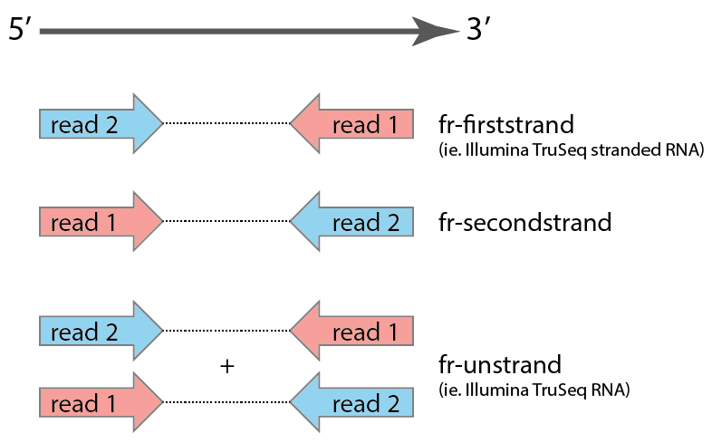
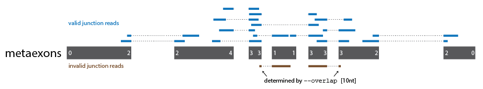

# SplicingRates

**Citation: Pai AA, Henriques T, McCue K, Burkholder A, Adelman K, and Burge CB. (2017). The kinetics of pre-mRNA splicing in the Drosophila genome and the influence of gene architecture. *eLife.* 6:e32537**

The splicing rates pipeline intends to...

1. splicingrates_introns: Identify and get coordinates for specific introns for which to calculate half-lives.
2. splicingrates_reads: Get exon-exon and intron-exon junction reads for the designated introns.
3. splicingrates_model: Estimate half-lives for the designated introns from 4sU-seq data.

Other folders in this repository include:

*eLife_manuscript/* Files to recreate the analyses and figures shown in Pai *et al.* eLife 2017
- SplicingRates.Rmd : R code to calculate and analyze mRNA splicing rats from Drosophila S2 4sU-seq data
- SplicingRates_figures.Rmd : R code to recreate figures in Pai *et al.* eLife 2017
*simulations/* Files for the simulations conducted in Pai *et al.* eLife 2017
- simulation.R : simulate nascent 4sU-seq reads across timepoints, genomic, and library parameters
- miso_modeling.R : simulation of PSI decreate method, where inputs are MISO summary PSI values computed with reads from simulation.R
- junction_modeling.R : simulation of junction dynamics method, where inputs are reads output from simulation.R


### Requirements (versions used for development)

- samtools (v1.3)
- bedtools (v2.26.0)
- python (v3.6.3)
- R (v)

#### Python Dependencies
- pysam (v0.16)
- pandas (v0.25.3)

## Table of contents
[Overview of splicing rates pipeline](#overview-of-splicingrates)

[Detailed Tutorial](#detailed-tutorial-to-run-the-splicingrates-pipeline)


## Overview of the Splicing Rates pipeline

The splicing rates pipeline was designed to be run on bam files containing mapped reads from a timecourse of 4sU-seq experiments. Here, we describe the usage of the three main steps of the splicing rates pipeline. Below, we provide sections that discuss alternative parameter usage for classification and quantification, as well as a tutorial walking through all the steps necessary to run the splicing rates pipeline.

<!---
<p align="center">

</p> 
-->

### Splicing Rates Introns
Get intron coordinates from a gtf file, parsing by type of intron. This step includes (a) identifying introns that are constitutive or alternative (or not restricting by either), and (b) calculating the distance from the 3' splice site to the end of the gene (3' distance).

```
usage: splicingrates_introns.py [-h] --gtf x.gtf [--introns {allintrons,alternative,constitutive}] 
                                     --outname

optional arguments:
  -h, --help            show this help message and exit

Input:
  --gtf gtf             gtf file from which to get annotations (full path) (default: None)

Parameters:
  --introns {allintrons, alternative, constitutive}     
                        comma-separated list of types of annotations to output
                        into a file (default: constitutive)

Output:
  --outname outname     basename of output file (full path) (default: None)
```

### Splicing Rates Reads
Identify and quantify exon-exon and intron-exon junction reads for designated introns. This step includes (a) specifying the intron regions from which to isolate reads, accounting for read length and (b) quantifying junction reads for specific introns.

```
usage: splicingrates_reads.py [-h] [--intronRegions] [--junctionReads]
                                    --bedname bedname --readlength readlength
                                   [--introns x.introntype.bed] [--bam x.bam]
                                   [--readtype {single,paired}] [--readstrand {fr-unstrand,fr-firststrand,fr-secondstrand}]

usage: splicingrates_reads.py [-h] --introns x.introntype.bed --readlength readlength
                              [--intronRegions] 
                              [--junctionReads] [--bam x.bam] [--readtype {single,paired}]
                              [--readstrand {fr-unstrand,fr-firststrand,fr-secondstrand}]

Get relevant intron-exon and exon-exon junction reads for splicing rate
estimation.

optional arguments:
  -h, --help            show this help message and exit
  --introns x.introntype.bed
                        bed file with specific introns for which to estimate
                        splicing rates. required if --intronRegions (default:
                        None)
  --readlength readlength
                        length of reads (default: None)

region information:
  --intronRegions       Calculate specific intronic regions to use for
                        grabbing reads (default: False)


read quantification:
  --junctionReads       Quantify junction reads from specified introns
                        (default: False)
  --bam x.bam           bam from which to extract junction reads. required if
                        --junctionReads (default: None)
  --readtype {single,paired}
                        type of read (default: paired)
  --readstrand {fr-unstrand,fr-firststrand,fr-secondstrand}
                        directionality of RNA-seq data 
                        (default: fr-firststrand)
```

### Splicing Rates Model
Estimate splicing rates (half-lives) for designated introns. This step includes estimating half-lives for either/or (a) each replicate individually and (b) junction read counts summed across replicates.

```
usage: splicingrates_model.py [-h] --basename x_Xm_repX --timepoints t1,t2,...tn 
                                   --replicates REPLICATES [--summed]
                                   --outname OUTNAME [--txnrate]
                                   --threedist x_threedist.txt

Estimate splicing rates (half-lives) using ie and ee junction reads.

optional arguments:
  -h, --help            show this help message and exit

read information:
  --basename BASENAME   basename of combo files, including path. 
                        expected to have '_Xm_repX' prefix
                        (default: None)
  --timepoints t1,t2,...tn
                        comma separated list of 4sU labeling timepoints
                        (minutes) (default: None)
  --replicates REPLICATES
                        number of replicates for each timepoint (default:
                        None)
  --summed              Estimate splicing rates with summed junction reads
                        (across replicates) (default: False)

model assumptions:
  --outname OUTNAME     name for final splicing rate output file (full path)
                        (default: None)
  --txnrate             transcription elongation rate in nt/min (default =
                        1500 nt/min) (default: 1500)
  --threedist x_threedist.txt
                        file with 3' distances for each intron from
                        splicinrates_introns.py (full path) (default: None)
```


## Detailed Tutorial to run the splicing rates pipeline

In this tutorial, we walk through all the steps to run the splicing rates pipeline, in the minimum number of command lines and each step individually. For each step, we discuss the possible parameters that can be changed, how to do so, and the considerations involved in each of the parameters. Finally, we show example inputs and outputs of each step (with column explanations) so the user knows what to expect and can make custom files as needed.

### Jump to a step:
[Step 0: Genome Alignment](#step-0-genome-alignment)

[Step 1: Intron Delineation](#step-0-introns)

[Step 2: Specifying intron regions](#step-1-intron-regions)

[Step 3: Extracting Junction Reads](#step-2-extracting-junction-reads)

[Step 4: Estimating Splicing half-lives](#step-3-estimating-splicing-rates)

### Step 0: Genome Alignment

Align raw reads in fastq format to the genome with your favorite splicing-aware mapper (ie. STAR | hisat2) to obtain a sorted, indexed bam file. When building a STAR index or running hisat2, we recommend using the same gtf annotation that you will use for downstream steps.

For instance, to map with STAR (using ENCODE parameters) and index the bam:

```
STAR --outFilterType BySJout --outFilterMultimapNmax 20 --alignSJoverhangMin 8 --alignSJDBoverhangMin 1 --outFilterMismatchNmax 999 --outFilterMismatchNoverLmax 0.04 --alignIntronMin 20 --alignIntronMax 1000000 --alignMatesGapMax 1000000 --outSAMtype BAM SortedByCoordinate

samtools index [bamfile].bam
```

**Sample Naming Convention**
Downstream steps assume that the bam file is named with the following convention: ```[samplename].[T]m.rep[N].bam```, where T is the 4sU labeling timepoint and N is the replicate. T can be a string (i.e. "totalRNA") as long as the "m" is included. Even if there is just 1 replicate, the "rep1" is expected to be included in the file name.

### Step 1: Intron Delineation

This step takes in an annotation file (gtf file) and outputs a bed file of intron coordinates for the type of introns specified. This only needs to be done once per genome.

Example usage:

```
python splicingrates_introns.py --gtf [annotations].gtf --introns constitutive 
                                --outname [genomename]
```

**Types of GTF files**

(1) Exons in gtf are sorted by genome coordinates (default):

```
```

(2) Exons in gtf are sorted by transcriptional direction (use ```--reverse```):

```
```

**Types of introns**

Users can choose which type of intron to output. Choices: allintrons, alternative, constitutive (default). The user provided basename will have either ```allintrons```, ```alternative_introns```, or ```constitutive_introns``` added before the extensions for each output file.

<p align="center">

</p>

**Intron coordinates**

Two files are output: </br>
(1) Precise intron coordinates [bed file, ```[genomename].[introntype].bed```]
(2) Distance from 3' splice site to the end of the annotated gene, which we call the 3' distance [txt file, extension .threedist]

<p align="center">

</p>

Example intron coordinate bed output:

```
```

Example 3' distance output:
```
```

### Get Overlapping Junction Reads

Example usage using default parameters to run both steps in tandem:

```
python splicingrates_reads.py --introns [genome].[introntype].bed --readlength 
                              --intronRegions 
                              --junctionReads --bam [sample].[T]m.rep[N].bam 
                              --readtype paired --readstrand fr-firststrand
```

### Step 2: Specifying Intron Regions

To only get intron regions which junction reads must overlap:

```
python splicingrates_reads.py --intronRegions --introns [genome].[introntype].bed --readlength
```

NOTE: This process accounts for the specific read length of the samples being analyzed. The step only needs to be performed once per read length for each genome. Three output files will be generated (as indicated in figure below):

(1) Intron-exon boundary regions: ```[genome].[introntype]_[readlength]nt_intron_ie.bed```
(2) Upstream exon region: ```[genome].[introntype]_[readlength]nt_exonup_ee.bed```
(3) Downstream exon region: ```[genome].[introntype]_[readlength]nt_exondown_ee.bed```

<!--- Add FIGURE -->

### Step 3: Extracting Junction Reads

To only extract junction reads:

```
python splicingrates_reads.py --junctionReads --bam [sample].[T]m.rep[N].bam --readtype paired --readstrand fr-firststrand 
```

Junction reads are extracted by parsing the CIGAR strings of mapped reads. To correctly assign junction reads the user needs to provide information about read type and strandedness of the reads: </br>
(1) Read type can be changed with ```--readtype``` with option {single or paired}, default: paired </br>
(2) Strandedness of the reads can be changed with ```--readstrand``` with options {fr-firststrand, fr-secondstrand, fr-unstrand}, default: fr-firststrand 

Strandedness is determined by the type of library preparation protocol. We borrow the library strandedness naming convention from Tophat/Bowtie:

<p align="center">

</p>

Junction reads are assigned to introns based on an matches to either the 3' intron-exon boundary (for intron-exon junction reads) or evidence for splicing together of two specific exon regions corresponding to the 5'ss and 3'ss of the designed intron (for exon-exon split junction reads). Split reads that arise from splicing using only one splice site of the pair will not be counted as a junction read for that intron. The minimum overlap length for junction reads is determined by ```--overlap```, with a default of 10nt. 

<p align="center">

</p>


**Output**

This step results in 5 types of files, grouped into three categories:

*intron-exon (IE) reads*
(1) bed file(s) of read start sites for non-split reads, named using ```[sample].[T]m.rep[N]_startsites_read[1/2].bed.gz```, with two files corresponding to each mate if using paired end reads.
(2) bed file(s) of ie reads based on read start falling into the intron-exon boundary region identified in Step 1, named using ```[sample].[T]m.rep[N]_iejunc.bed.gz```.

*exon-exon (EE) reads*
(3) bam files containing only the split exon-exon junction reads, named using ```[sample].[T]m.rep[N]_junctions.bam```. 
(4) bed files containing only exon-exon junction reads overlapping the corresponding exon-exon boundary region identified in Step 1, named using ```[sample].[T]m.rep[N]_ee[up/down]junc.bed.gz```

(5) *Combined junction reads*: Coverage file containing the final ie and ee junction read count for each intron, named using ```[sample].[T]m.rep[N]_junctionCombo.coverage``` and with the following format:

```
```

### Calculating Splicing Rates

### Step 4: Estimating Splicing half-lives

To calculate splicing half-lives:

```
python splicingrates_model.py --basename [sample] --timepoints t1,t2,tn
                              --replicates N --outname [sample] 
                              --threedist [genome].[introntype].threedist
                              --summed --txnrate 1500
```

This script takes in all samples from the study, across timepoints and replicates, and calculates splicing half-lives in one of two way:
(1) For each replicate individually, using samples from each timepoint within the replicate (assumes timepoints from the same replicate have been conducted using the same cells or in a single experimental workflow).
(2) Across all the samples, using the sum of junction reads from each replicate to create a single sample per timepoint. To run the script in this mode, use ```--summed```.

Example Inputs:
(1) basename: *FlyS2* for bam files that are named, *FlyS2_5m_rep1*, *FlyS2_10m_rep1*, and *Fly_20m_rep1*
(2) timepoints: *5,10,20*
(3) replicates: *3*
(4) outname: *FlyS2_splicingrates*
(5) threedist: *drosmel6_constitutive_introns.threedist*

**Output**

This step results in ```.halflives``` file(s) with the following columns (one per each replicates, and one for summed reads if specified):

| Column Name | Description |
| ----------- | ----------- |
| intron | intron name, with coordinates and gene name |
| Tm_ie | count of intron-exon junction reads in timepoint T (repeated for each timepoint) |
| Tm_ee | count of exon-exon junction reads in timepoint T (repeated for each timepoint) |
| Tm_ratio | ratio of ie/ee reads in timepoint T (repeated for each timepoint) |
| Tm_Dprime | D' value, short-form simplification for model fitting |
| Tm_Rprime | R' value, short-form simplification for model fitting |
| half.life | splicing half-life (minutes) |
| fit.error | error around the fit from the R optim function |

The final output file is filtered to meet the following conditions:
(1) Introns for which the optim function in R was able to find a local minimum and thus the fit succeeded.
(2) Introns with exon-exon junction reads in the last timepoint, as evidence that splicing occured within the timecourse. This filter will remove introns that are spliced very slowly, such that splicing begins after the last timepoint in the timecourse.
(3) Introns with intron-exon junction coverage in the first timepoint, as evidence that splicing occured within the timecourse. This filter will remove introns that are spliced very quickly, such that splicing is entirely completed before the first timepoint in the timecourse.
